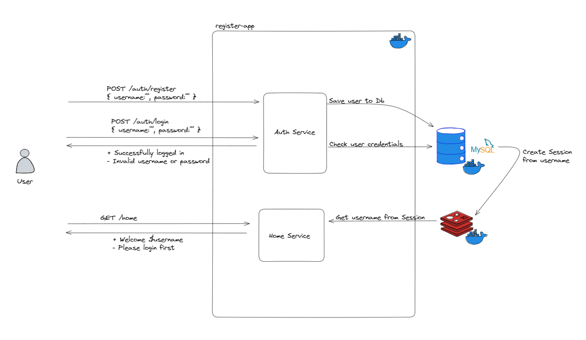

# Spring Boot Session Managment With Redis

### Architecture


### Application Logic
When you log in using the application, your session is saved to Redis. This means that even if the application is restarted, your session will not be invalidated because it is already stored in Redis.

## Technologies
- Java 17
- Spring Boot 3.0
- Spring Data JPA
- Redis
- MySQL Database
- Restful API
- Maven
- Docker
- Docker Compose

## Prerequisites
- Maven or Docker

## Docker Run
The application can be built and run by the `Docker` engine. The `Dockerfile` has multistage build, so you do not need to build and run separately.

Please follow the below directions in order to build and run the application with Docker Compose;

```sh
$ cd spring_session_redis
$ docker-compose up -d
```

## Maven Run
To build and run the application with `Maven`, please follow the directions below;

```sh
$ cd spring_session_redis
$ mvn clean install
$ mvn spring-boot:run
```
